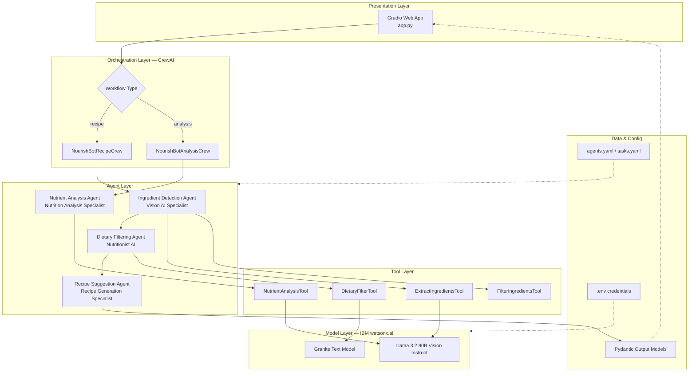
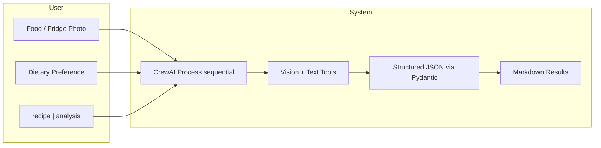
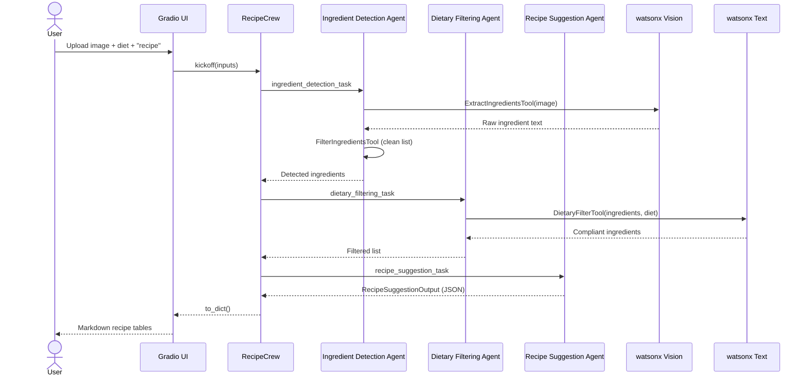
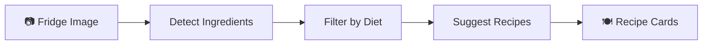
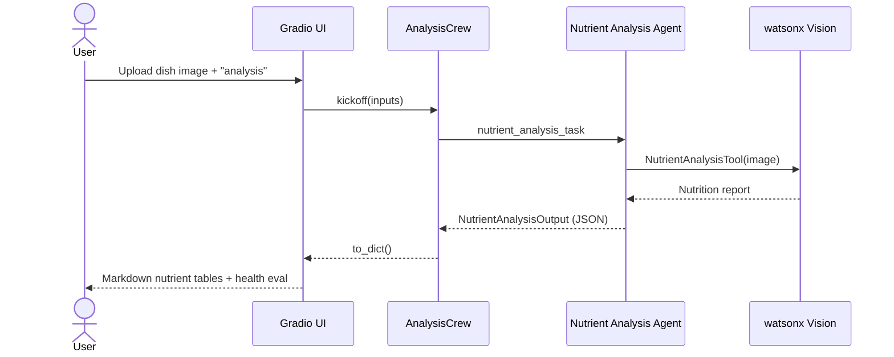
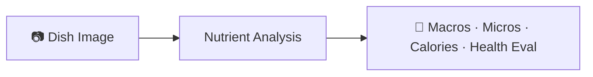
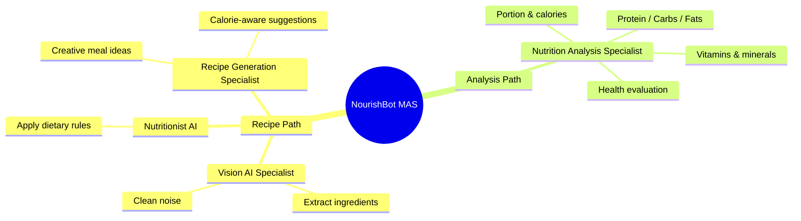
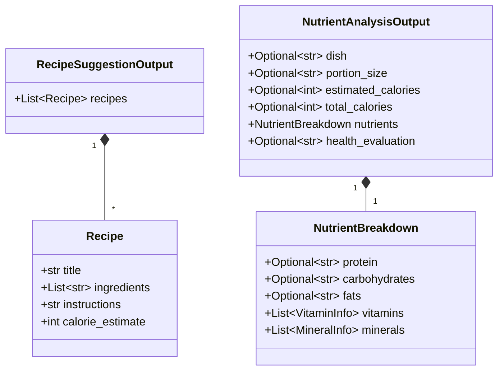

# AI NourishBot with CrewAI

A production-oriented **Multi-Agent System (MAS)** that turns food photos into personalized nutrition insights and recipe ideas. Specialized CrewAI agents collaborate with IBM watsonx.ai vision/text models, and Gradio exposes the whole pipeline as an interactive web app.

NourishBot goes beyond food recognition: it offers dynamic advice from dietary preferences and suggests recipes from what is in your fridge—feeling less like a static app and more like an intelligent wellness partner.

---

## Table of Contents

- [Features](#features)
- [Architecture](#architecture)
- [Multi-Agent Workflows](#multi-agent-workflows)
- [Project Structure](#project-structure)
- [Tech Stack](#tech-stack)
- [Getting Started](#getting-started)
- [Usage](#usage)
- [Agents & Tools](#agents--tools)
- [Configuration](#configuration)
- [Disclaimer](#disclaimer)

---

## Features

| Capability | Description |
|---|---|
| **Fridge → Recipes** | Detect ingredients from a fridge/pantry photo, apply dietary filters, suggest recipes |
| **Dish → Nutrition** | Analyze a plated meal for macros, micros, calories, and a health evaluation |
| **Dietary awareness** | Optional restrictions (vegan, keto, gluten-free, …) applied by a dedicated agent |
| **Structured outputs** | Pydantic models keep recipe and nutrient results consistent for the UI |
| **Interactive UI** | Gradio Blocks app with examples, progress, and Markdown-formatted results |

---

## Architecture

High-level view of how the Gradio UI, CrewAI orchestration, tools, and watsonx models fit together.



### Component responsibilities



---

## Multi-Agent Workflows

### 1. Recipe workflow

Upload a fridge / ingredients image → detect → filter by diet → suggest recipes.





### 2. Analysis workflow

Upload a plated dish → nutrient breakdown + health evaluation.





### Agent collaboration overview



---

## Project Structure

```text
AI-NourishBot-with-CrewAI/
├── app.py                      # Gradio entrypoint (UI + formatting)
├── requirements.txt
├── pyproject.toml
├── .env.example                # Credential template (copy → .env)
├── .gitignore
├── README.md
├── examples/                   # Sample images for Gradio Examples
│   └── .gitkeep
├── uploads/                    # Ephemeral uploads (gitignored)
│   └── .gitkeep
└── src/
    ├── __init__.py
    ├── crew.py                 # CrewBase agents, tasks, Recipe & Analysis crews
    ├── models.py               # Pydantic schemas for structured outputs
    ├── tools.py                # CrewAI tools (vision + dietary filtering)
    ├── watsonx_client.py       # Centralized watsonx credentials & models
    └── config/
        ├── agents.yaml         # Agent roles, goals, backstories
        └── tasks.yaml          # Task descriptions & expected outputs
```

---

## Tech Stack

| Layer | Technology |
|---|---|
| Multi-agent orchestration | [CrewAI](https://www.crewai.com/) (`Process.sequential`) |
| Vision LLM | IBM watsonx — `meta-llama/llama-3-2-90b-vision-instruct` |
| Text LLM | IBM watsonx — `ibm/granite-4-h-small` |
| Structured I/O | Pydantic v2 |
| Agent/task config | YAML |
| Web UI | Gradio Blocks (Citrus theme) |
| Secrets | `python-dotenv` + `.env` |

---

## Getting Started

### Prerequisites

- Python **3.10+**
- An [IBM Cloud](https://cloud.ibm.com/) account with watsonx.ai access
- A watsonx **Project ID** and **API key**

### 1. Clone & create a virtualenv

```bash
cd AI-NourishBot-with-CrewAI
python -m venv .venv
source .venv/bin/activate   # Windows: .venv\Scripts\activate
```

### 2. Install dependencies

```bash
pip install -r requirements.txt
```

### 3. Configure environment

```bash
cp .env.example .env
```

Edit `.env` and set at least:

```env
WATSONX_API_KEY=your_ibm_cloud_api_key_here
WATSONX_PROJECT_ID=your_watsonx_project_id
WATSONX_URL=https://us-south.ml.cloud.ibm.com
```

### 4. (Optional) Add example images

Place sample photos under `examples/` as:

- `examples/food-1.jpg` — fridge / ingredients (recipe demo)
- `examples/food-2.jpg` — plated dish (analysis demo)
- `examples/food-3.jpg` — fridge / ingredients (keto recipe demo)
- `examples/food-4.jpg` — plated dish (analysis demo)

If these files are missing, the Gradio Examples panel is simply hidden.

### 5. Launch the app

```bash
python app.py
```

Open **http://127.0.0.1:5000** in your browser.

---

## Usage

1. **Recipe ideas** — Upload a fridge/pantry photo, optionally set a dietary restriction (e.g. `vegan`), choose **recipe**, click **Analyze**.
2. **Nutritional analysis** — Upload a photo of a complete dish, leave diet blank, choose **analysis**, click **Analyze**.
3. **Examples** — If sample images are present, click an example row to autofill inputs, then **Analyze**.

Results render as Markdown tables (ingredients, macros, vitamins/minerals, health evaluation).

---

## Agents & Tools

### Agents (`src/config/agents.yaml`)

| Agent | Role | Responsibility |
|---|---|---|
| `ingredient_detection_agent` | Vision AI Specialist | Identify ingredients from images |
| `dietary_filtering_agent` | Nutritionist AI Specialist | Keep only diet-compliant ingredients |
| `recipe_suggestion_agent` | Recipe Generation Specialist | Invent recipes from filtered ingredients |
| `nutrient_analysis_agent` | Nutrition Analysis Specialist | Macros, micros, calories, health eval |

### Tools (`src/tools.py`)

| Tool | Used by | Model |
|---|---|---|
| `ExtractIngredientsTool` | Ingredient Detection | Vision (Llama 3.2 90B) |
| `FilterIngredientsTool` | Ingredient Detection | Local parsing |
| `DietaryFilterTool` | Dietary Filtering | Text (Granite) |
| `NutrientAnalysisTool` | Nutrient Analysis | Vision (Llama 3.2 90B) |

### Structured outputs (`src/models.py`)



---

## Configuration

| Variable | Default | Purpose |
|---|---|---|
| `WATSONX_API_KEY` | _(empty)_ | IBM Cloud API key |
| `WATSONX_PROJECT_ID` | `skills-network` | watsonx project |
| `WATSONX_URL` | `https://us-south.ml.cloud.ibm.com` | Regional endpoint |
| `VISION_MODEL_ID` | `meta-llama/llama-3-2-90b-vision-instruct` | Image understanding |
| `TEXT_MODEL_ID` | `ibm/granite-4-h-small` | Dietary filtering |
| `GRADIO_SERVER_NAME` | `127.0.0.1` | Bind host |
| `GRADIO_SERVER_PORT` | `5000` | Bind port |
| `LOG_LEVEL` | `INFO` | Logging verbosity |

Agent personalities and task prompts live in YAML so you can tune behavior without touching Python:

- `src/config/agents.yaml`
- `src/config/tasks.yaml`

---

## Production notes

- **Secrets** — Never commit `.env`; use `.env.example` as the template.
- **Temp uploads** — Images are written under `uploads/` and removed after each run.
- **Errors** — Crew failures are caught and shown in the Gradio result panel with stack traces in logs.
- **Extensibility** — Add agents/tasks in YAML + `src/crew.py`, or new tools in `src/tools.py`, without changing the UI contract.
- **Process model** — Both crews use `Process.sequential` so task context flows reliably: detect → filter → recipes, or single-step analysis.

---

## Disclaimer

Nutritional information and calorie estimates are **approximate** and based on general food data. Actual values vary with portion size, ingredients, preparation, and individual factors. For precise dietary or medical advice, consult a qualified nutritionist or healthcare provider.

---

## License

MIT
